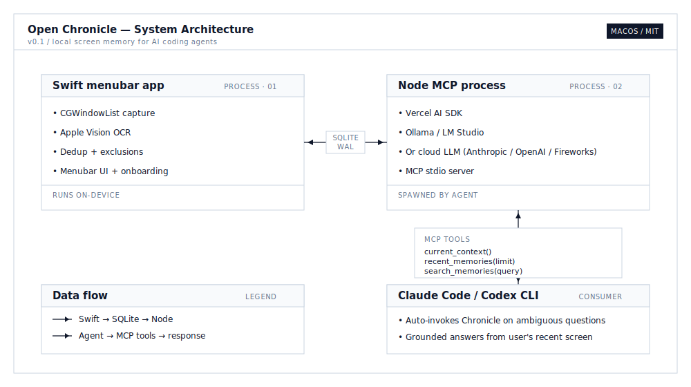

# Open Chronicle

> **Give your AI coding agent photographic memory.**
> Local screen capture → on-device OCR → LLM summaries → exposed to Claude Code and Codex CLI over MCP.
> **Runs 100% offline** with Ollama or LM Studio — or plug in any cloud LLM (Anthropic / OpenAI / Fireworks).

<p align="center">
  <a href="https://youtu.be/V75tnvIdovc" target="_blank">
    
  </a>
  <br/>
  <em>▶️ <a href="https://youtu.be/V75tnvIdovc">Watch the 6-second demo</a></em>
</p>

<p align="center">
  <a href="https://github.com/Screenata/open-chronicle/releases"></a>
  <a href="LICENSE"></a>
  
  
  
  
</p>

---

## Why

Every developer knows this moment:

> "Why is **this** failing?"
> — _Claude has no idea what "this" is._

Or:

> "Continue **where I left off**."
> — _Claude has no idea where you left off._

AI coding agents forget your context the moment you switch apps. Open Chronicle fixes that by giving them a rolling, local, screen-derived memory of what you were just doing.

## How it works

<p align="center">
  
</p>

1. **Capture** — menubar app screenshots the frontmost editor/terminal/browser every few seconds
2. **Extract** — Apple Vision OCRs each capture, on-device, no cloud
3. **Summarize** — MCP server groups captures into 1-minute windows and asks an LLM for a 2-sentence summary
4. **Serve** — Claude Code or Codex CLI calls the MCP server when you ask ambiguous questions, and answers with specific, grounded context

Supported LLM providers:

- **Anthropic**, **OpenAI**, **Fireworks** — cloud APIs
- **Ollama**, **LM Studio** — fully local, no API key required
- **OpenAI-Compatible (custom)** — any endpoint speaking the OpenAI API: Baseten, Groq, Together, DeepInfra, Perplexity, self-hosted vLLM / TGI, etc.

All switchable from the Settings tab.

## Install

Install is source-based for now — the binary isn't code-signed / notarized yet, so Gatekeeper would block a downloaded `.app` for most users. Clone and build locally:

```bash
git clone https://github.com/Screenata/open-chronicle
cd open-chronicle/app
swift run -c release
```

Click the memory-chip icon that appears in your menubar. A **first-run wizard** walks you through:

1. **Screen Recording permission** — one-click grant
2. **LLM provider + API key** — pick provider, paste key
3. **Agent integrations** — auto-detects Claude Code / Codex CLI and wires both up (MCP registration + auto-invoke rule in `~/.claude/CLAUDE.md` and `~/.codex/AGENTS.md`)

Restart Claude Code (or Codex) — that's it.

### Prerequisites

- macOS 14+
- Xcode Command Line Tools (`xcode-select --install`)
- Node 20+
- An API key from [Anthropic](https://console.anthropic.com), [OpenAI](https://platform.openai.com), or [Fireworks](https://fireworks.ai) — **or** a local [Ollama](https://ollama.ai) install for 100% offline summarization
- [Claude Code](https://claude.ai/code) and/or [Codex CLI](https://github.com/openai/codex)

## Try it

Work in your editor for 2-3 minutes. Then open Claude Code from anywhere and ask:

> `what was I just working on?`

> `continue where I left off`

> `why is this failing?`

The agent will auto-invoke Chronicle and answer with specific file names, PR numbers, and error messages pulled from what it saw on your screen.

<p align="center">
  <a href="https://youtu.be/V75tnvIdovc" target="_blank">
    
  </a>
  <br/>
  <em>Left: terminal with Claude Code. Right: Chronicle's live memory sidebar.</em>
</p>

## Features

- **Menubar app** — record/pause toggle, timeline of recent memory cards, detail view with screenshot preview
- **Onboarding wizard** — one-click install and agent registration, no terminal commands required
- **Floating window** — detach the memory view as an always-on-top panel (great for demos and persistent awareness)
- **Multi-agent** — Claude Code and Codex CLI both supported; onboarding detects and configures each
- **Privacy-first defaults** — password managers, messaging apps (Slack, WeChat, Signal, WhatsApp, Messages), mail clients, and system utilities are excluded from capture by default
- **User exclusion list** — add more apps to skip from the Settings tab
- **Configurable everything** — capture interval, memory window, screenshot TTL, LLM provider/model all editable in-app

## Configuration

All settings live in `~/.open-chronicle/open-chronicle.db` and are editable from the **Settings tab** in the menubar app.

| Setting | Default | What |
|---|---|---|
| Capture interval | 10 sec | How often to take a screenshot when the active app changes |
| Memory window | 60 sec | How much activity is grouped into a single memory |
| Screenshot retention | 30 min | How long raw PNGs are kept before auto-deletion |

Environment variables (in `mcp/.env`):

| Var | Default | What |
|---|---|---|
| `CHRONICLE_LLM_PROVIDER` | `anthropic` | `anthropic`, `openai`, or `fireworks` |
| `CHRONICLE_LLM_MODEL` | provider default | Specific model ID |
| `CHRONICLE_MEMORY_INTERVAL_MS` | `30000` | How often the memory builder polls for new windows |

## Data & privacy

Everything is under `~/.open-chronicle/`:

- `open-chronicle.db` — SQLite (captures, memories, settings)
- `screenshots/` — raw PNGs, auto-expire per retention setting
- `mcp.log` — diagnostic log from the memory builder

**Nothing is synced or uploaded.** If you pick a cloud LLM (Anthropic / OpenAI / Fireworks), the only outbound network call is to that provider for text summaries. If you pick **Ollama** or **LM Studio**, there are **zero outbound network calls** — the entire pipeline runs on-device. Your API keys (if any) stay in `mcp/.env` on your machine.

You can **wipe all data** at any time from Settings → Data → *Clear all data*.

### Apps excluded by default

Chronicle never captures these, regardless of your configuration:

- **Password managers:** 1Password, Bitwarden, Dashlane, LastPass
- **Messaging:** Messages, Slack, Discord, Signal, Telegram, WhatsApp, Lark, WeChat, QQ
- **Mail:** Apple Mail, Outlook, Spark, AirMail
- **System:** Finder, System Settings, Activity Monitor, Wallet

You can add more exclusions from the Settings tab.

## Demo this in your own workflow

A single screenshot is worth a thousand prompts — try these:

- `what was I just working on?` — rolling memory retrieval
- `continue where I left off` — task resumption
- `why is this failing?` — ambiguous pronoun resolution
- `which docs page was I reading?` — browser history, but better
- `summarize my last hour` — unexpected productivity tool

## Troubleshooting

<details>
<summary><strong>"Screenshot failed — check Screen Recording permission"</strong></summary>

System Settings → Privacy & Security → Screen Recording → toggle Terminal (or wherever you launched the app from) on. Relaunch.
</details>

<details>
<summary><strong>No memories appearing</strong></summary>

The MCP server is what generates memories, and it's only running when Claude Code (or Codex) has it connected. Restart your agent. Or test the pipeline manually: `cd mcp && npm run dev`. You should see log lines like `[open-chronicle] Memory created: "..."`.

Also check `~/.open-chronicle/mcp.log` for any LLM API errors.
</details>

<details>
<summary><strong>Agent doesn't auto-invoke Chronicle</strong></summary>

Check that `~/.claude/CLAUDE.md` (or `~/.codex/AGENTS.md`) contains the `<!-- chronicle-auto-invoke -->` block. If missing, re-run the onboarding wizard.

Verify MCP is connected: run `/mcp` in Claude Code and confirm `open-chronicle` is listed.
</details>

<details>
<summary><strong>Stale MCP process</strong></summary>

If you updated the code but the agent still shows the old behavior:

```bash
pkill -f 'open-chronicle/mcp/src/index'
```

Then restart your agent.
</details>

## Not on the roadmap

Intentionally out of scope:

- Cross-platform (Linux/Windows) — macOS-first is a feature, not a limitation
- Long-term memory consolidation across weeks/months
- Audio or accessibility-tree capture
- Cloud sync
- Vector embeddings / semantic search

## On the roadmap

- ScreenCaptureKit migration (replace deprecated `CGWindowListCreateImage`)
- Per-project memory scoping
- FTS5 keyword search
- Local LLM support via Ollama
- Brew formula for one-command install

## Contributing

This is a proof-of-concept launched to prove a thesis. If you find it useful, please:

- ⭐ **Star the repo** — it helps other devs discover it
- 🐦 **Share the demo** — tag [@Screenata](https://x.com/Screenata) or whoever built this for you
- 🐛 **Open an issue** — bug reports, feature requests, or just "this helped me today"
- 🔧 **PR it** — especially: new supported editors (add bundle IDs), new LLM providers, UI polish

## License

MIT — see [LICENSE](LICENSE).

---

<p align="center">
  <em>Built by developers tired of retyping context to their AI agent.</em>
</p>
